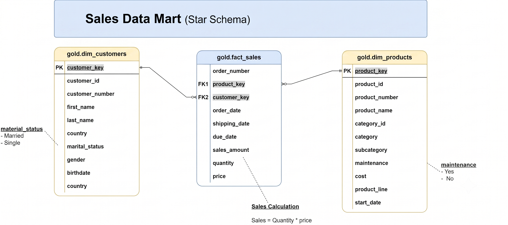

# SQL Data Warehouse Project

This project builds a modern data warehouse using SQL Server, consolidating sales data from two source systems, ERP and CRM, into a clean, business ready star schema for analytics and reporting. It's designed as a portfolio project that demonstrates end to end data engineering practices: source system analysis, ETL pipeline development, data cleansing, data modeling, and documentation.

---

## Data Architecture

The warehouse follows the **Medallion Architecture**, structured across three layers: Bronze, Silver, and Gold.


| Layer | Definition | Objective | Object Type | Load Method | Transformations | Data Model | Audience |
|---|---|---|---|---|---|---|---|
| **Bronze** | Raw, unprocessed data as-is from sources | Traceability & debugging | Tables | Full load (truncate & insert) | None (as-is) | None (as-is) | Data Engineers |
| **Silver** | Cleaned & standardized data | Prepare data for analysis | Tables | Full load (truncate & insert) | Cleaning, standardization, normalization, derived columns, enrichment | None (as-is) | Data Analysts, Data Engineers |
| **Gold** | Business ready data | Serve reporting & analytics | Views | None | Data integration, aggregation, business logic | Star schema, flat tables | Data Analysts, Business Users |

**Bronze Layer**: Ingests raw CSV files from CRM and ERP into SQL Server tables exactly as received, with no transformations, for full traceability back to the source.

**Silver Layer**: Cleanses, standardizes, and normalizes the Bronze data. This includes removing duplicates, handling missing and invalid values, casting data types, trimming unwanted spaces, and adding derived columns.

**Gold Layer**: Integrates the cleaned Silver tables into a business friendly star schema, applying business rules and aggregations so the data is ready to query directly for reporting.

---

## Data Flow (Lineage)

Each source table flows through all three layers before reaching its final Gold object.


- `crm_sales_details` → Bronze → Silver → **gold.fact_sales**
- `crm_cust_info` + `erp_cust_az12` + `erp_loc_a101` → Bronze → Silver → **gold.dim_customers**
- `crm_prd_info` + `erp_px_cat_g1v2` → Bronze → Silver → **gold.dim_products**

---

## Data Integration

The CRM and ERP systems are related through shared keys, which is how customer and product records get combined into single, unified dimensions.


- **CRM** holds transactional sales data (`crm_sales_details`), core product info (`crm_prd_info`), and core customer info (`crm_cust_info`).
- **ERP** supplements this with product categories (`erp_px_cat_g1v2`), extra customer details like birthdate (`erp_cust_az12`), and customer location (`erp_loc_a101`).
- CRM and ERP tables are joined on shared keys (`prd_key`, `cst_id` / `cid`) to build the unified `dim_customers` and `dim_products` tables in the Gold layer.

---

## Data Model: Star Schema

The Gold layer is modeled as a **Sales Data Mart** using a star schema, with one fact table surrounded by two dimension tables.



- **gold.fact_sales**: order number, product key (FK), customer key (FK), order/shipping/due dates, sales amount, quantity, and price. Sales amount is calculated as `quantity * price`.
- **gold.dim_customers**: customer key (PK), customer ID, customer number, name, country, marital status, gender, birthdate, and create date.
- **gold.dim_products**: product key (PK), product ID, product number, product name, category, subcategory, maintenance flag, cost, product line, and start date.

---

## ETL Methodology

Each layer follows the same four step build process: analyze the source, code the load/transform logic, validate the results, and document and version the work in Git.


- **Extraction**: Pull vs push extraction, full vs incremental extraction, using techniques like database querying, file parsing, API calls, and CDC.
- **Load**: Full load (truncate & insert, drop & recreate, or upsert) and incremental load (append, upsert, or merge), with Slowly Changing Dimension (SCD) strategies considered for historization.
- **Transformation**: Data cleansing (handling missing/invalid values, removing duplicates, outlier detection, data type casting), normalization and standardization, business rules, derived columns, data enrichment, and aggregations.

For this project specifically: Bronze uses full load via `TRUNCATE` and `BULK INSERT` from CSV files (batch processing, no historization required per project scope). Silver applies cleansing and standardization through stored procedures. Gold applies integration and business logic through views, requiring no physical load.

---

## Project Requirements

### Building the Data Warehouse (Data Engineering)

**Objective**: Develop a modern data warehouse using SQL Server to consolidate sales data, enabling analytical reporting and informed decision making.

**Specifications**:
- **Data Sources**: Import data from two source systems (ERP and CRM), provided as CSV files.
- **Data Quality**: Cleanse and resolve data quality issues before loading into the Silver layer.
- **Integration**: Combine both sources into a single, user friendly data model designed for analytical queries.
- **Scope**: Focus on the latest dataset only; historization of data is not required.
- **Documentation**: Provide clear documentation of the data model, naming conventions, and data catalog to support both business stakeholders and analytics teams.

### BI: Analytics & Reporting (Data Analysis)

**Objective**: Develop SQL based analytics to deliver detailed insights into:
- **Customer Behavior**
- **Product Performance**
- **Sales Trends**

These insights empower stakeholders with key business metrics to support strategic decision making. See the companion [SQL Data Analytics project](https://github.com/aditi593/SQL_Datawarehouse-project) for the exploratory and advanced analytics built on top of this warehouse.

---

## Naming Conventions

All objects follow `snake_case`, use English names, and avoid SQL reserved words.

| Layer | Pattern | Example |
|---|---|---|
| Bronze | `<sourcesystem>_<entity>` | `crm_customer_info` |
| Silver | `<sourcesystem>_<entity>` | `crm_customer_info` |
| Gold | `<category>_<entity>` | `dim_customers`, `fact_sales` |

- **Surrogate keys** in dimension tables use the suffix `_key` (e.g., `customer_key`).
- **Technical/metadata columns** use the prefix `dwh_` (e.g., `dwh_load_date`).
- **Stored procedures** for loading follow `load_<layer>` (e.g., `load_bronze`, `load_silver`).

Full details are in [`docs/naming_conventions.md`](docs/naming_conventions.md).

---

## Data Catalog (Gold Layer)

| Table | Purpose |
|---|---|
| `gold.dim_customers` | Customer details enriched with demographic and geographic data (name, country, marital status, gender, birthdate) |
| `gold.dim_products` | Product attributes including category, subcategory, cost, product line, and maintenance flag |
| `gold.fact_sales` | Transactional sales data linking customers and products, with order dates, sales amount, quantity, and price |

Full column level documentation is in [`docs/data_catalog.md`](docs/data_catalog.md).

---

## Repository Structure

```
data-warehouse-project/
│
├── datasets/                           # Raw datasets used for the project (ERP and CRM data)
│
├── docs/                                # Project documentation and architecture details
│   ├── data_architecture.png            # High level architecture: sources → Bronze/Silver/Gold → consume
│   ├── data_flow.png                    # Data lineage from source tables to Gold objects
│   ├── data_integration.png             # How CRM and ERP tables relate to each other
│   ├── data_model.png                   # Star schema diagram for the Gold layer
│   ├── ETL.png                          # ETL methods reference (extraction, load, transformation)
│   ├── data_catalog.md                  # Catalog of Gold layer tables, including field descriptions
│   ├── naming-conventions.md            # Naming guidelines for tables, columns, and stored procedures
│
├── scripts/                             # SQL scripts for ETL and transformations
│   ├── bronze/                          # Scripts for extracting and loading raw data
│   ├── silver/                          # Scripts for cleaning and transforming data
│   ├── gold/                            # Scripts for creating analytical views
│
├── tests/                               # Data quality and validation checks
│
├── README.md                            # Project overview and instructions
├── LICENSE                              # License information for the repository
├── .gitignore                           # Files and directories to be ignored by Git
└── requirements.txt                     # Dependencies and requirements for the project
```

---

## Tools Used

- **SQL Server Express**: Lightweight server for hosting the database
- **SQL Server Management Studio (SSMS)**: GUI for managing and interacting with the database
- **DrawIO**: Used to design the data architecture, data flow, integration, and data model diagrams
- **Git & GitHub**: Version control and project hosting

---

## About This Project

This project was built to apply core data engineering practices end to end: interviewing source systems, ingesting raw CSVs, cleansing and standardizing data, and modeling it into a business ready star schema. It pairs with the [SQL Data Analytics project](https://github.com/aditi593/SQL_Datawarehouse-project), which uses this warehouse's Gold layer as the base for exploratory and advanced analytics.

Course reference: this project was built while following Baraa Khatib Salkini's free SQL course, *Data with Baraa*, on YouTube.# Data Warehouse and Analytics Project

